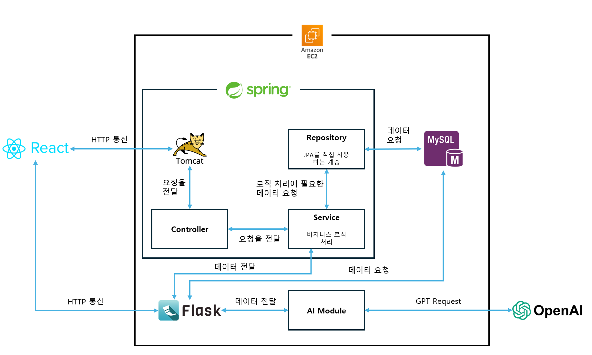
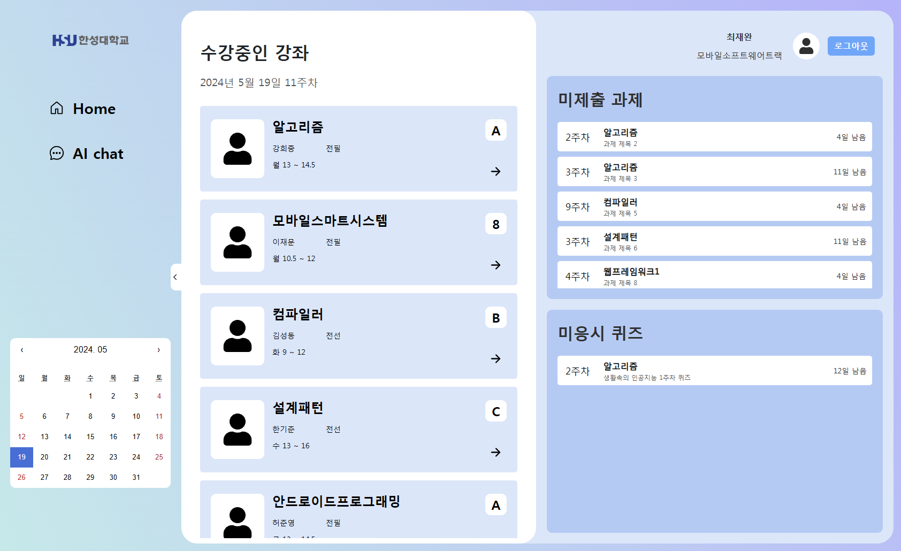
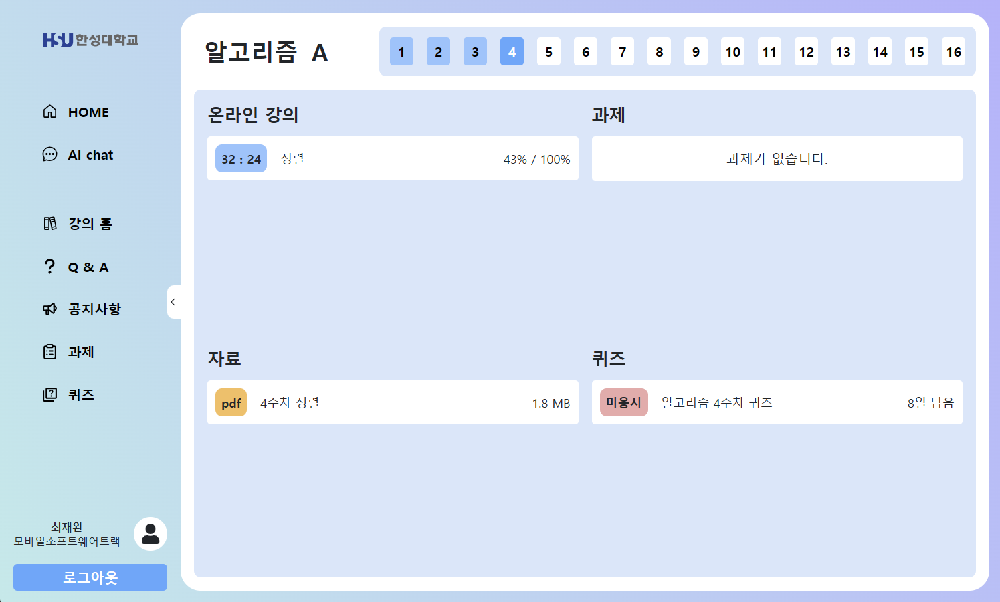
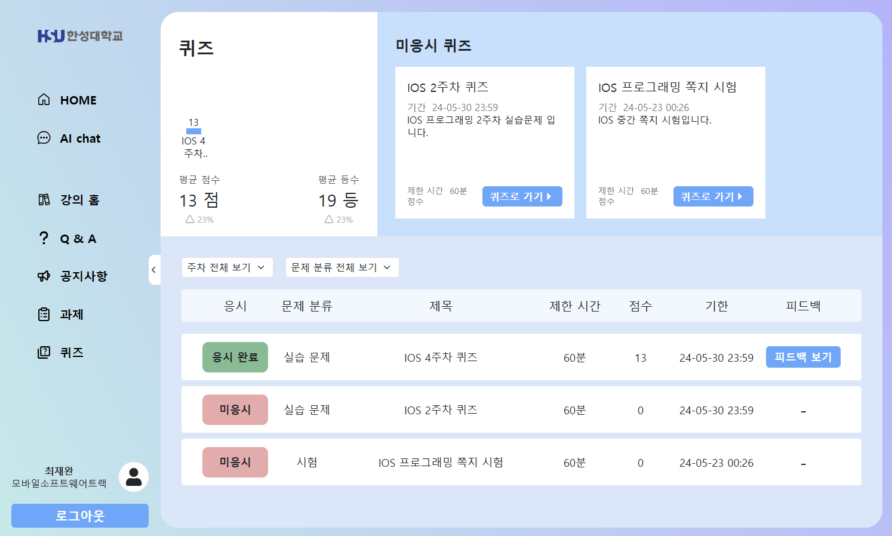
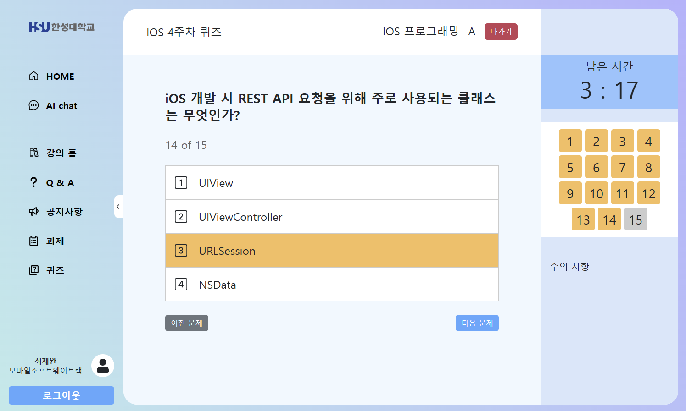
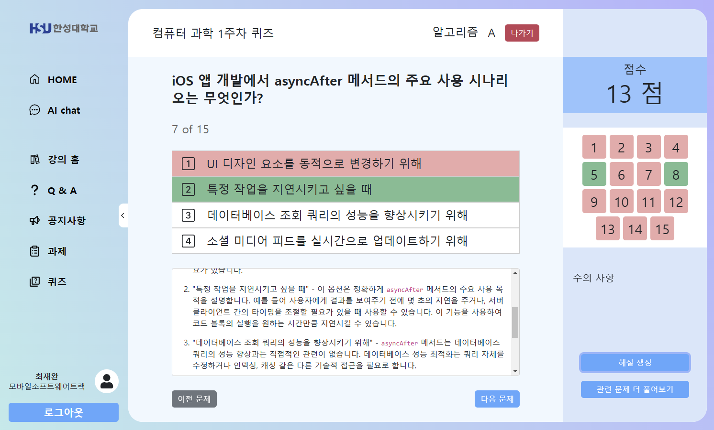
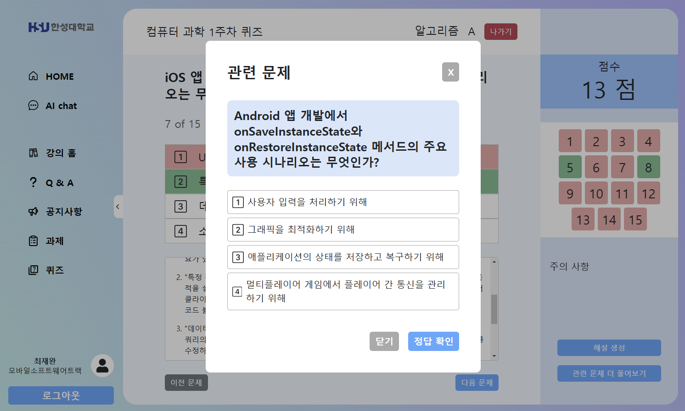
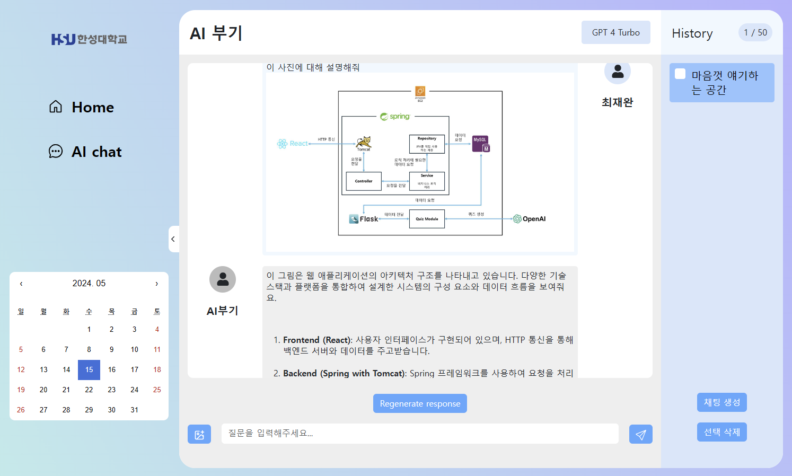
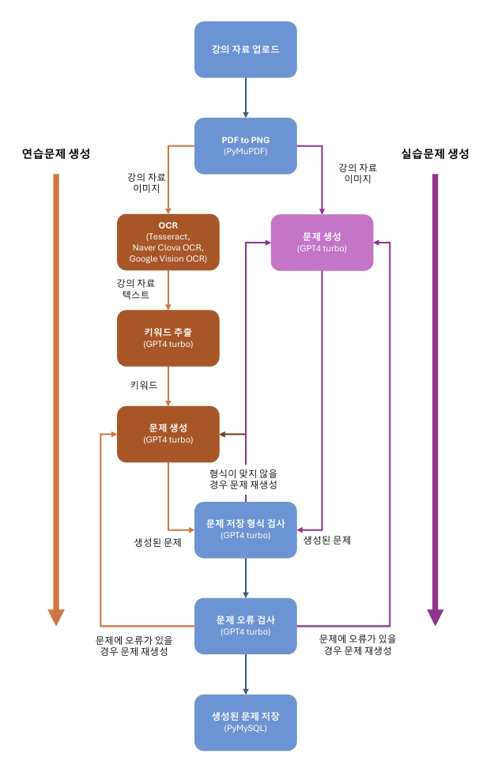
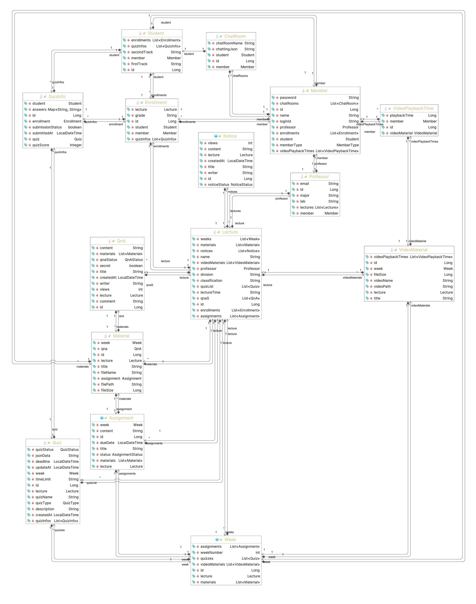

# Eclass+

## 한성대 캡스톤 팀 JBUGS

### GPT4-turbo 기반 PDF 강의 자료와 이미지를 활용한 문제 생성 및 해설이 가능한 AI 강화 스마트 온라인 교육 플랫폼

### AI-Enhanced Smart Online Education Platform Capable of Generating Questions and Explanations Using PDF Lecture Materials and Images Based on GPT4-turbo

## 🔔 작품 소개

E class+는 코로나 19 이후 대학 교육 환경에서 급속히 증가하는 블렌디드 수업과 온라인 학습의 필요성을 고려하여 개발된 혁신적인 교육 플랫폼입니다.

이 프로젝트는 한성대학교의 기존 eclass 플랫폼에서 발생한 불편함을 해소하고 학생들의 학습 경험을 향상시키기 위해 개발되었습니다.

## 🚨기존 Eclass에 대한 학생들의 불편 사항

- **메인페이지**

  1. 과제 확인이 어렵다.
  2. UI가 깔끔하지만 불필요한 기능이 많아 보인다.

- **강의페이지**
  1. 주차가 거듭될수록 마우스 드래그의 횟수가 늘어난다.
  2. 불필요한 기능이 많아 보인다.
  3. 강의와 과제가 섞여 나오는 경우가 있어 불편하다.

## 📄주요 기능 및 특징

- **연습문제 자동 생성**
  

  &nbsp;&nbsp;&nbsp;&nbsp;강의 자료를 분석하여 중요 키워드와 이미지를 기반으로 관련 연습문제를 자동으로 생성합니다. 각 연습문제는 학습 내용을 체계적으로 복습할 수 있도록 설계되어 있으며, 학생들이 강의 내용을 심도 깊게 이해하도록 돕습니다.
  

 

- **퀴즈 해설 자동 생성**
  

  &nbsp;&nbsp;&nbsp;&nbsp;각 연습문제에 대하여 자동으로 해설을 생성합니다. 이는 학생들이 문제를 해결하는 과정에서 발생할 수 있는 어려움을 해소하고, 문제의 해결 방법을 명확하게 이해하는 데 큰 도움을 줍니다.
  

 

- **비슷한 유형 문제 자동 생성**
  

  &nbsp;&nbsp;&nbsp;&nbsp;학생이 풀었던 문제와 비슷한 유형의 문제를 추가로 생성하여 제공합니다. 이를 통해 학생들은 특정 주제에 대한 이해를 한층 더 깊이할 수 있으며, 다양한 문제를 접함으로써 보다 폭넓은 지식을 쌓을 수 있습니다.
  

 

- **챗봇 기능 제공**
  

  &nbsp;&nbsp;&nbsp;&nbsp;학생들이 언제든지 질문할 수 있는 AI 기반 챗봇을 제공합니다. 이 챗봇은 학습 관련 질문뿐만 아니라, 개인별 맞춤형 학습 진도 확인 및 조언을 제공하며, 이미지를 포함한 질문에도 응답할 수 있는 기능을 지니고 있습니다.
  

 

- **사용자 인터페이스 개선**
  

  &nbsp;&nbsp;&nbsp;&nbsp;Eclass + 의 사용자 인터페이스는 직관적이고 사용하기 쉽게 설계되어 있으며, 사용자의 피드백을 반영하여 지속적으로 개선됩니다. 이를 통해 학생과 교수자 모두가 보다 편리하게 플랫폼을 사용할 수 있습니다.
  

 

## 🔗프로젝트 구조도

## 💻개선된 페이지

- **메인 페이지**

  

  - **캘린더 추가**  
  &nbsp;&nbsp;&nbsp;&nbsp;날짜 확인 간편화 및 개인 일정 등록 가능  
  - **미제출 과제 표시**  
  &nbsp;&nbsp;&nbsp;&nbsp;미제출 과제 확인 가능  
  - **미응시 퀴즈 표시**  
  &nbsp;&nbsp;&nbsp;&nbsp;미응시 퀴즈 확인 가능  
  - **UI 간결화**  
  &nbsp;&nbsp;&nbsp;&nbsp;불필요한 기능 축소화  
   

- **강의 페이지**

  

  - **유연한 내비게이션**  
    &nbsp;&nbsp;&nbsp;&nbsp;사이드바를 통한 다양한 메뉴 접근 가능성(홈, AI 채팅, 강의 활동, Q&A 등)
  - **진도율 트래킹 및 시각화**  
    &nbsp;&nbsp;&nbsp;&nbsp;강의 진행 상태를 시각적으로 표시하는 진도율 바 제공
  - **주차별 강의 내용 접근**  
    &nbsp;&nbsp;&nbsp;&nbsp;중앙의 주차별 접근 바를 사용하여 각 주차의 강의 콘텐츠에 쉽게 접근
  - **UI 간결화**  
    &nbsp;&nbsp;&nbsp;&nbsp;불필요한 기능 축소화

- **퀴즈 페이지**

  - **퀴즈 리스트**

    

    - **퀴즈 점수 보드**  
      &nbsp;&nbsp;&nbsp;&nbsp;제출한 퀴즈의 점수 및 평균 점수 확인 가능
    - **미응시 퀴즈 보드**  
      &nbsp;&nbsp;&nbsp;&nbsp;미응시 퀴즈 한눈에 보기
    - **하단의 퀴즈 리스트**  
      &nbsp;&nbsp;&nbsp;&nbsp;주차, 분류 필터를 통해 원하는 퀴즈 검색 가능

  - **퀴즈 풀기**

    

    - **키워드 기반 연습문제 생성**  
      &nbsp;&nbsp;&nbsp;&nbsp;강의 자료 중 중요 키워드 추출 후 연습문제 생성
    - **강의 자료 이미지 기반 연습문제 생성**  
      &nbsp;&nbsp;&nbsp;&nbsp;강의 자료를 이미지로 변환 후 이미지를 통해 퀴즈 생성

  - **피드백 보기(해설 생성)**

    

    - **해설 생성**  
      &nbsp;&nbsp;&nbsp;&nbsp;문제를 기반으로 학생들이 필요한 경우 해설 생성 가능

  - **관련 문제 생성**

    

    - **관련 문제 생성**  
      &nbsp;&nbsp;&nbsp;&nbsp;학생들이 비슷한 유형의 추가 학습이 필요한 경우 자유롭게 관련 문제 생성 가능

- **이미지 포함 챗봇 페이지**

  

  - **이미지를 포함한 챗봇 기능**  
    &nbsp;&nbsp;&nbsp;&nbsp;기존의 텍스트 기반 챗봇과 더불어 이미지를 통한 질문으로써 학생들의 학습의 질 향상

## ⚙ 퀴즈 생성 모듈 구조

## 📄Domain 다이어그램

## ⌨ 주요 적용 기술 및 특이 사항

- **개발 환경** : Windows, Mac OS, Ubuntu
- **개발 도구** : Visual Studio Code, IntelliJ, MySQL workbench
- **개발 언어** : Javascript, Java, Python
- **주요 기술** : React, Spring Boot, Flask, GPT4 turbo

## ✋개발자

| 역할 | 이름   | 개발 분야                               |
| ---- | ------ | --------------------------------------- |
| 팀장 | 최재완 | AI 모듈 개발, UI 설계 및 개발, AWS 구축 |
| 팀원 | 장주찬 | DB 설계 및 구축, Rest-API 개발          |
| 팀원 | 진승원 | UI 설계 및 개발, 동적 UI 구현           |
